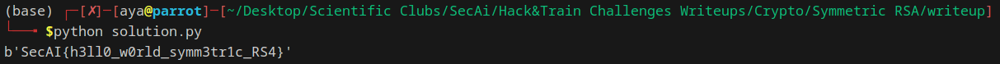

# Challenge Description:

**Challenge Name:** Symmetric RSA<br>
**Category:** Cryptography <br>
**Description:** 
Who needs public keys?

## Initial Analysis:
* We are given the following code:

```python
from Crypto.Util.number import long_to_bytes as ltb, bytes_to_long as btl, getPrime

p = getPrime(1024)
q = getPrime(1024)

n = p*q

e = p

with open("flag.txt", "rb") as f:
	PT = btl(f.read())

CT = pow(PT, e, n)
print(f"{CT = }")

chances = [-1, 2]
for chance in chances:
	CT = pow(chance, e, n)
	print(f"chance {chance}: {CT = }")
```

* The given python code does the following:
1. Generate two random prime numbers of 1024 bits to define **p** and **q**
2. Use a symmetric key e = p
3. Read the flag from the file **flag.txt** (which is of course omitted from the directory in which the challenge is available) and convert it into a long
4. Store the plain text (flag) in the variable PT
5. Compute the cipher text using the following formula:
$$CT = PT^e \mod N$$
6. Compute and Print the cipher text for two different messages -1 and 2, we'll know why we've chosen these specific values a bit later

## Initial Analysis:
* At the beginning, having the value of the cipher text won't be much beneficial, because we don't have the value of the private key d
* Now, we want to find the value of d, so that we can compute the plain text value. For sure, we are going to be using the cipher text values for the other two plain text values
* d is the modular inverse of the public key e obtained using the following formula:
$$d = e^{-1} \mod \phi(N)$$ 
* Thus, to obtain d, we need to evaluate N, e, p and q. Since this encryption is symmetric (e=p) and because N = p*q, then all we need to do is to find the values for N and p 

### How to find N?
* Let's consider the two chances given to use 
* In the first chance we are computing the cipher text of -1 using the same parameters used to encrypt the flag
$$
CT_1 = (-1)^e \mod N \\
\implies CT_1 = (-1)^p \mod N \\ 
\implies CT_1 = (-1)^p = -1 \mod N  \:(since \:p\: is\: a\: prime\:  number,\:  then\:  p\:  is\:  odd) \\
\implies CT_1 = -1 \mod N \\
\implies CT_1 = -1 = N-1 \mod N  \:(if \:you're \:not \: convinced \: why \: this \: is \: true, \: just \: start \: from \: 0=N \mod N \: and \: subtract \: 1 \: from \: both \: sides) \\
\implies CT_1 = N-1 \mod N 
$$

* Thus with our first output (chance 1), just add 1 to the result to obtain the value of N

### How to find p?
* Since p| N, then the following does hold:
$$
(A \mod N) = A \mod p
$$

### Why does this hold?

1. Set \( A = N \cdot k + M \) for some integers \( k \) and \( M \).  
2. Since \( p \mid N \), we have \( p \mid N \cdot k \).  
3. Therefore, \( p \mid N \cdot k - A + A \).  
4. This implies \( p \mid (A - N \cdot k - A) \).  
5. Thus, \( p \mid M - A \).  
6. Finally, \( p \mid (A \mod N) - A \).

Hence,  
$$
(A \mod N) = A \mod p
$$

* Now, according to Fermat's little theorem, if p is a prime number, then for any integer a, the number a^p − a is an integer multiple of p
* Thus:
$$
(a^p \mod N) = a^p \mod p  \:(as \: shown \:  previously) \\
\implies (a^p \mod N) = a^p = a \mod p  \:(apply \: Fermat's \: Little \: Theorem) \\
\implies (a^p \mod N) = a \mod p \\
\implies (a^p \mod N) - a = 0 \mod p \\
\implies (a^e \mod N) - a = 0 \mod p \\  \:(since \: e = \: p)
\implies CT(a) - a = 0 \mod p \\ 
$$

* Therefore, for any number a, subtract its value from the computed cipher text to obtains a new value, I will denote it with B where p| B (p divides B)
* Now how to get p knowing that p| N and p| B
* Just compute the gcd of B and N
* The code which implements the logic presented above is given as follows:
```python
from Crypto.Util.number import long_to_bytes as ltb, GCD

#data given in CT.txt
CT = 474447171160791767258953879457506479972588120820618908514066758635114480805408980691332624716157701563249215273161150745705495897987288659724754885410582121243693264720066336562341319364812918756858813983134483113530126205791453456607683035482846768509859297977486687622507019723732987835677953689325055891071767960018076649808873506854402779497743688334607920736752138938563046752029358418826703056404507381782257406595605632544297121118970427409798319617891860286118534571153246609742863171446883364405391023137185596964785512481960575384751211378572043636401175524985320694829786753088504536104542388292886498120
CT_1 = 29696537999073632892822137631414650042665845217888025530678106270488301372632383076083852700017193869872758689737610454257473188868096609503001196326704292846932672943684152745951352775781088294764361112355752350046543411495044464492812426163977723936642807200603705010099677727384914293611307846059139209315243636230830648675554728180502587111120208404976813352306391889291501444133295691381067636645539403455189370080965504716153225158810109485022301162304084443801866614447197680276256411719095586375786961463857945191101292782954552754934966363775805861764834912942649167754505158218772668236507272871451697171598
CT_2 = 3455294446286991248311927689951734121931789445133869781870093760626759958802969332977544407280288778617180046241850873671861433821613482511819721244442359142783903783554918561683748786164259431731112598145309861760608401225786587621934302662222113247925096312808753762127453350716920442630859318756239278923364037400829834115533506283743336674928942363190778822405110272141795374232789481060481006174740498931846521299911584910687767180138487308108041009744335120546429629422237011270322729715176786962793722141189038115835991109553983251085260344602592841371827921731295069095527557266018854127954216130487361157790

#Get N
N = CT_1 + 1

#Get p
p = GCD(N, CT_2 - 2)

#Get q knowing that N = P * q
q = N // p

#defin e
e = p

#Compute d
d = pow(e, -1, (p-1)*(q-1))

#Evaluate the flag
flag = ltb(pow(CT,d,N))

#Print the flag
print(flag)
```

Congratulations ;)
