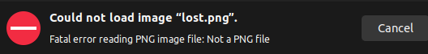
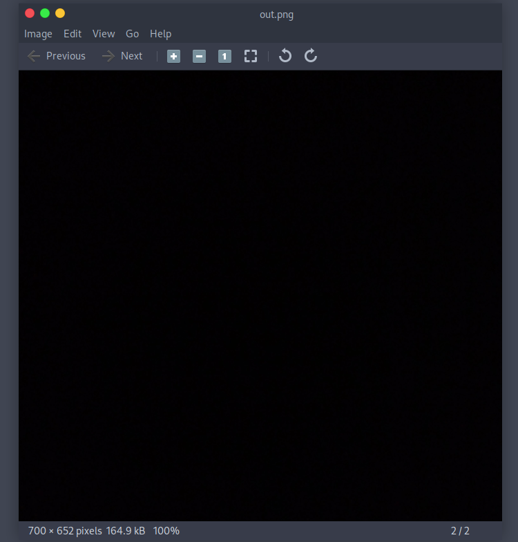
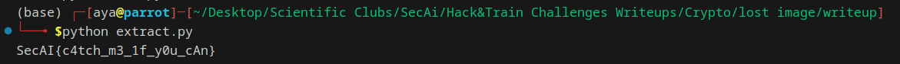

# Challenge Description:

**Challenge Name:** lost image
**Category:** Cryptography+Steganography
**Description:** 
1. Can u help recover this corrupted image?
2. Can u help extract the flag from the pixels of the image?

## Initial Analysis:

Opening the image graphically does not seem to help in anyway, as it sounds like the image type does not match its format, pay attention to this detail because I am going to tell you why once you are ready for that

image

Let's get our hands dirty with the code

```python
import os 
from pwn import xor

key = os.urandom(8)


flag = open('flag.png' , 'rb').read()
xored_flag = xor(flag , key)

open('lost.png' , 'wb').write(xored_flag)
```

What is going on?
* The code reads the file located in the same directory containing the flag 
* It is then generating a random byte string of 8 bytes as the encryption key 
* Then, it writes the result of computing flag xor key to the image "image.png" within the same directory


# Phase 01: recovering the corrupted image
## In-depth solution steps:
* In this particular example, we are going to be building the solution code accumulatively
* To have the xored flag in the challenge, we have to extract the content of lost.png as bytes

```python
from pwn import xor

xored_flag = open('lost.png', 'rb').read()
```
> Note: since the key length is less than the image length, then image bytes after the 8th one continue to be xored with the corresponding bytes of the key
* We know that:
xored_flag = flag **xor** key
* Our goal is to find the flag, right? but how to do so?
* Try to xor the key from both sides you will get the following: 
xored_flag = flag **xor** key
**=>** xored_flag **xor** key = flag **xor** key **xor** key
**=>** xored_flag **xor** key = flag **xor** 0
But what is a number xor 0? 

It is the number itself

Not convinced yet? try to xor 1 with 0, you get a 1, now try to xor 0 with 0, you get 0

So ultimately we get:
**flag = xored_flag xor key**

* Now that we know how to extract the flag, we figure out that we don't have the corresponding key as it was randomly generated, don't try to brute force it please, you may crash your machine :)
* So, our goal for now, is to find the key
* Fortunately, we know the signature of a PNG file, that is, the first 8 bytes of a png file are known and always the same, those are:

```python
from pwn import xor

xored_flag = open('lost.png', 'rb').read()
signature = bytes.fromhex('89504E470D0A1A0A')
```

* We have:
first_8Bytes_xored_file = key xor signature
* By xoring the signature in both sides of the equation and following the same logic used previously, we get:

key = first_8Bytes_xored_file xor signature

* Let's translate it into code:

```python
from pwn import xor

xored_flag = open('lost.png', 'rb').read()
signature = bytes.fromhex('89504E470D0A1A0A')

key = xor(signature, xored_flag[:len(signature)])

flag = xor(xored_flag, key)

open('out.png', 'wb').write(flag)
```


* Congratulation :) You are done with the first phase of the challenge

* The image now looks like this


* Nothing obvious from the image itself
* Let's proceed with the second phase

# Phase 02: Extracting the flag from the pixels of the image:
* A common steganography technique includes embedding strings in the LSB of pixel values, i.e, the LSB of the blue channel of the image pixels
* There are many libraries which can be used for image analysis. Since I am a lover of python, I will proceed with Python's Pillow library to examine pixel data
* I have included the python code to extract the flag along with some explanation as pre comments

```Python
from PIL import Image

# Open the image
image = Image.open("out.png")

# Get the height and the width for the image
WIDTH, HEIGHT= image.size

#load the pixels of the image into a matrix
pixels = image.load()


def extract(pixels):
    binary_flag=""

    #extracting the lsb from the blue channel from the pixels of the image
    for i in range (image.width):
        for j in range (image.height):
            pixel = pixels[i, j] #get the specific pixel from the image

            # Retrieve the blue channel value
            blue_channel = pixel[2] #the third channel

            # Convert the blue channel value to binary and extract the LSB then Extract the LSB by indexing from the end
            blue_channel_LSB = bin(blue_channel)[-1]  

            # Append the LSB to binary_flag
            binary_flag += blue_channel_LSB

    return binary_flag


binary_flag = extract(pixels)

#to obtain the ASCII representation of the flag
n = int(binary_flag, 2)
print(n.to_bytes((n.bit_length() + 7) // 8, 'big').decode())
```


Here comes the flag
