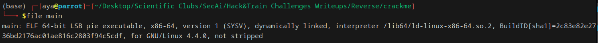
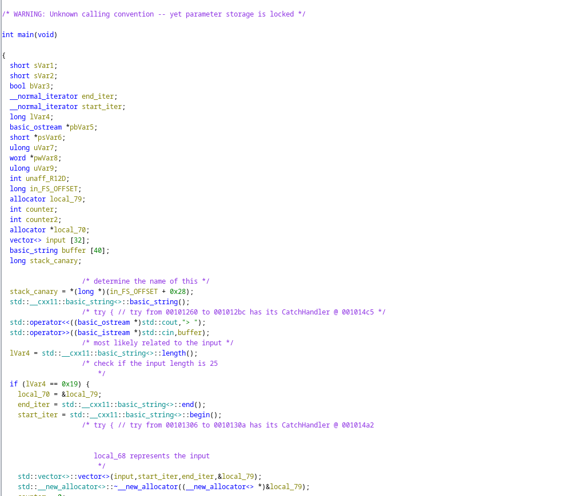
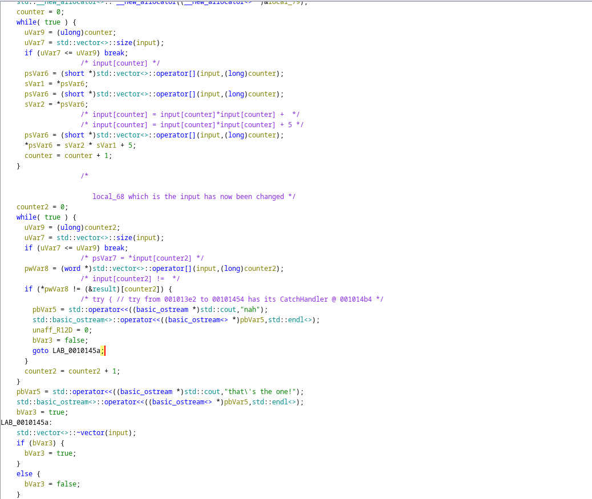
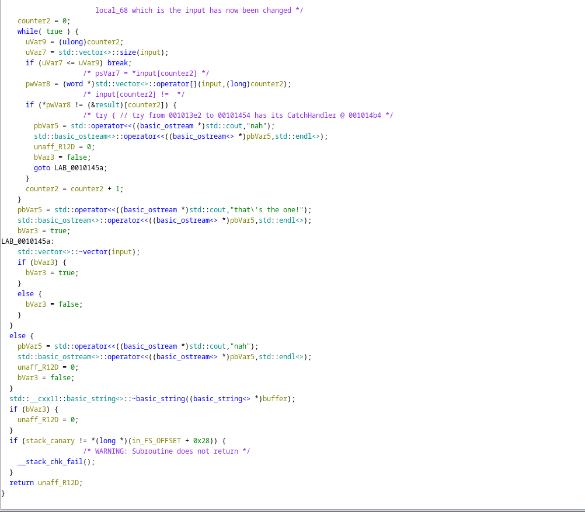
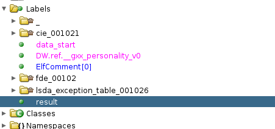
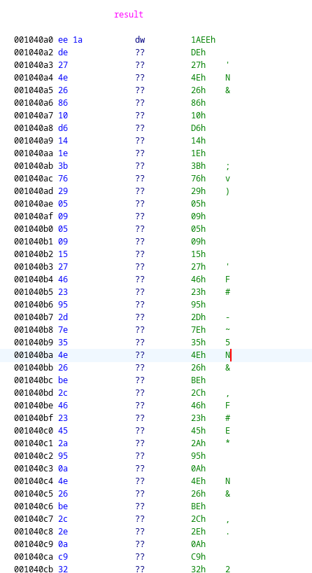
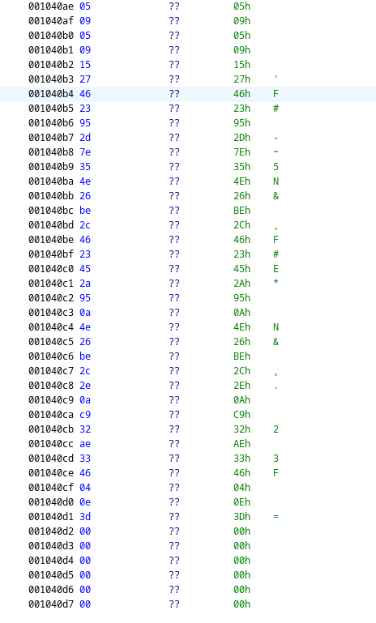
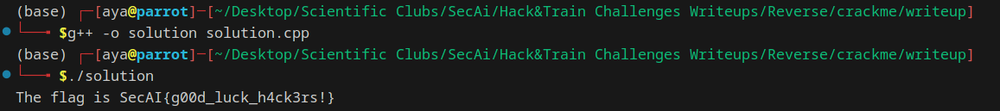

# Challenge Description:

**Challenge Name:** crackme
**Category:** Reverse Engineering
**Description:** just learned a new language! let's see what you can do ;)

## Initial Analysis:
* The initial step of solving a reverse engineering challenge is to execute the **file** command
```Bash 
file main 
```
The output is given here:

* Fortunately, the executable file is not-stripped, which mean that the binary file retains its symbol table and other debugging information, thus investigating it with ghidra would be of interest

## Exploiting the binary file using Ghidra:
* After inspecting the binary file using ghidra and renaming some of the variables, the decompiled code looks like this:




* What does the program do?
1. The program reads the input from the user (I named it buffer)
2. The program checks if the length of the input is 25, if so the execution continues, otherwise the program outputs "nah" and exits. Therefore we don't want the execution of the program to reach this bloc, that being said, the size of the input should be 25
3. The program then loops over all the characters of the buffer, and transforms each character of the input, such that
buffer[i] = buffer[i] * buffer[i] + 5
4. The execution goes through a second loop to check if the resulting buffer matches the **result** array, which appears here:

5. If the **result** array defined  matches the transformed buffer, the program outputs "that\'s the one!", which means the flag should drive the execution of the program to this block

* How to craft the input buffer to get to the output "that\'s the one!"? Because if we do so, we should have entered the flag itself

## Solution Steps
1. Define the result array




1. Copy the **result** entries to a new array which should be the transformed flag, let's call it t_flag
2. Subtract 5 from each entry of t_flag and take the square root of it
3. Convert each integer to a characters, combine the characters and you should be able to output the flag

Here is the code for the algorithm above:
```cpp
#include <iostream>
#include <math.h>

using namespace std;

int main()
{

    // defining the result array (an array of shorts)
    short result[25] = {0x1aee, 0x27de, 0x264e, 0x1086, 0x14d6,
                        0x3b1e, 0x2976, 0x0905, 0x0905, 0x2715, 
                        0x2346, 0x2d95, 0x357e, 0x264e, 0x2cbe, 
                        0x2346, 0x2a45, 0x0a95, 0x264e, 0x2cbe,
                        0x0a2e, 0x32c9, 0x33ae, 0x0446, 0x3d0e };

    // defining the transformed version of the flag
    int flag_1[25]; //notice that the last character must be a null terminator, thus the flag length is 24
    for (int i = 0; i < 25; ++i)
    {
        flag_1[i] = result[i];
    }
    char flag[25] = {};
    for (int i = 0; i < 25; ++i)
    {
        int temp = sqrt(flag_1[i] - 5);
        flag[i] = (char)temp;
    }

    cout << "The flag is " << flag << endl;

    return 0;
}
```



Congratulations ;)