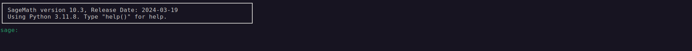

## Challenge Description:
<br>

**Category:** Cryptography<br>
**Points:** 120<br>
**Description:** Can you help Charles - who doesn't have any knowledge about cryptography, get the golden ticket and have a trip to Willy Wonka's factory ?<br>

## Environment Setup:
Before we get started, please make sure to have [Sage Math](https://www.sagemath.org/) installed on your system.<br>
Please refer to the [installation guide](https://doc.sagemath.org/html/en/installation/index.html) to have sage up and running on your system.<br>
But how are we going to use it and why?

## Initial Analysis:
The challenge includes the python code shown below:<br>

```python 
from Crypto.Util.number import *

#Some magic from Willy Wonka
def chocolate_generator(m:int) -> int:
    p = 396430433566694153228963024068183195900644000015629930982017434859080008533624204265038366113052353086248115602503012179807206251960510130759852727353283868788493357310003786807
    return (pow(13, m, p) + pow(37, m, p)) % p

#The golden ticket is hiding inside chocolate
flag = b"idek{DEPRECATED}"
golden_ticket = bytes_to_long(flag)
flag_chocolate = chocolate_generator(golden_ticket)
chocolate_bag = []

#Willy Wonka is making chocolates
for i in range(golden_ticket):
    #print("The value of the function for the current i is: ", chocolate_generator(i))
    chocolate_bag.append(chocolate_generator(i))

#And he put the golden ticket at the end
chocolate_bag.append(flag_chocolate)

#Augustus ate lots of chocolates, but he can't eat all cuz he is full now :D
remain = chocolate_bag[-2:]

#Can you help Charles get the golden ticket?
print(remain)

#[88952575866827947965983024351948428571644045481852955585307229868427303211803239917835211249629755846575548754617810635567272526061976590304647326424871380247801316189016325247, 67077340815509559968966395605991498895734870241569147039932716484176494534953008553337442440573747593113271897771706973941604973691227887232994456813209749283078720189994152242]
```

The previous program defines a function called chocolate_generator() which takes as input an integer m, computes then returns the following formula:


$$\left(\left(13^m mod\space p\right) + \left(37^m mod\space p \right) \right) mod\space p \space \space \space \space \space \space \space  (1)$$

It then defines an empty list chocolate_bag and converts the flag from bytes to long which is stored in the variable golden_ticket, then starts a loop that keeps iterating until the golden_ticket-1. For each iteration, the integer i is applied to the formula above and the result is appended to the list chocolate_bag. At the end, the list is appended a last element which is the result of passing golden_ticket(the converted flag) to **(1)**


The most interesting part is that finally the program extracts the last two items and print them. 
We can clearly see the two-items list commented at the bottom of the program. As you might have already guessed, this is the remain of the **actual flag** not the one given in the code.

**What is the next step now? shall we run the code?**<br>
Running the code in this case is not really going to help us in any way because we already have the output, what we are looking for is the input.

Let's consider the given **"remain"**, we'll denote the converted flag from bytes to long with **m**, the first element of remain i.e remain[0] with **B** and the last element of remain i.e remain[1] with **A**.
 
I am going to adjust the equations we have so far with the notations I have just introduced:

$$\left(13^{(m-1)} mod\space p\right) + \left(37^{(m-1)} mod\space p \right) ≅  B \space\space\space\space mod \space p \space \space \space \space \space \space \space \space \space \space \space \space \space \space \space  (2)$$

$$\left(13^{m} mod\space p\right) + \left(37^{m} mod\space p \right)  ≅  A \space\space\space\space mod \space p \space \space \space \space \space \space \space \space \space \space \space \space \space \space \space  (3)$$

Interesting, isn't it?! let's try to combine both **(2)** and **(3)** into something that we can deal with:
$$(3)-13.(2) => (37-13).31^{(m-1)} ≅ (A-13.B) \space\space mod \space p \\
\\ => 31^{(m-1)}  ≅  \frac{A-13.B}{24} \space\space mod \space p$$

We have come into a modular equation that most of us are probably familiar with, it a Descrete Logarithm Problem (**DLP**)

Now, all we need is to evaluate m to get our flag

How to solve a DLP?
You might think of some algorithms like the Baby Step Giant Step algorithm, the Pollard Rho algorithm, the Pohlig-Hellman algorithm... but none of them are going to be quite interesting in our challenge because p is too large :)

And here Sage Math comes into play, sage MATH is a comprehensive and powerful tool for mathematical computation, and it will be really helpful to sove a problem like the DLP

```markdown
Again, if you don't have sage math installed to your system, refer to the link below:
https://doc.sagemath.org/html/en/installation/index.html
```

1. Start sage:


1. Define the variables A and B


1. Define p


1. Denote the right hand side with R and the left hand side with L


1. Find the value of m-1


1. Find the flag after adding 1 to the value obtained in m_minus_one, and converting it using long_to_bytes which is imported from Crypto.Util.number


**And here you go :)** I hope you liked it and learned some new things from it.
<br>
If you have any questions feel free to reach out.
<br>

**Peace**